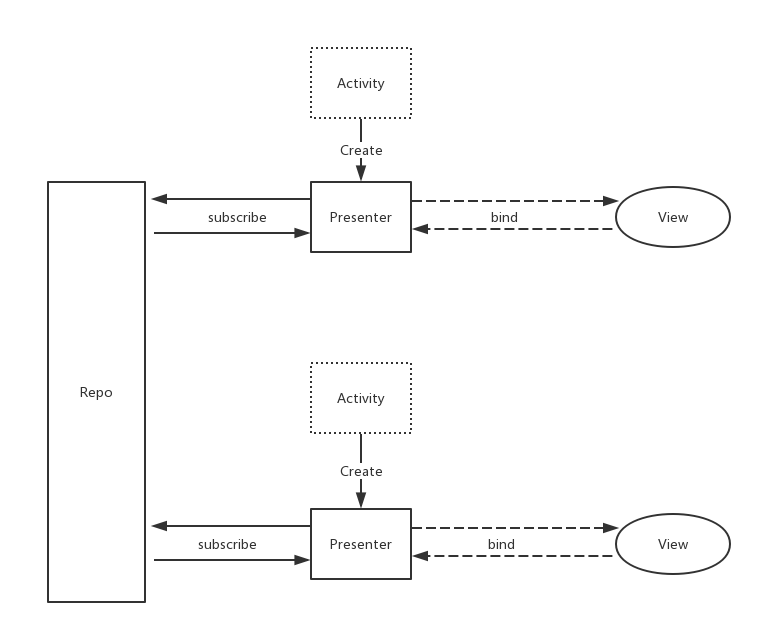

# Jarvis Android MVVM框架
Jarvis 是一个 Android MVVM 框架。基于 DataBinding。  
Jarvis 的目的并不是一个标准，完美，满足代码洁癖患者的框架，他的设计重心在于大量减少应用开发冗余代码与操作，让开发者能够快速构建应用。为此牺牲了一些完美架构的优点，一切为了开发体验。
内部直接支持了应用开发很多常用模式。


## Design
架空Activity，使逻辑交给Presenter，Presenter与View通过Databinding进行双向绑定。大量支持RxJava。




## Simple Usage

#### 1. 依赖
```grovvy
    compile 'com.jude:jarvis:1.0.0'
```

#### 2. 使用 DataBinding

```groovy
android {
    dataBinding {
        enabled = true
    }
}
```

#### 3. 继承Activity/Fragment
将所有的Activity均继承自`JarvisActivity<P>`。
```java
public class AboutActivity extends GrandStoreBaseActivity<AboutPresenter>{
}
```
参数 P 为 Presenter 的类型。
Activity 不用再写任何代码。
#### 4. 写页面xml
```xml
<layout xmlns:android="http://schemas.android.com/apk/res/android"
    xmlns:app="http://schemas.android.com/apk/res-auto"
    xmlns:tools="http://schemas.android.com/tools"
    tools:context="me.ele.grandstore.me.ele.grandstore.AppsActivity">

    <data>
        <variable name="presenter" type="me.ele.grandstore.presentation.AboutPresenter"/>
    </data>
    ……
</layout>
```
所有的 xml 中均声明一个 Presenter。 类名就填 xml 对应的 Presenter 的类名。

#### 5. 写Presenter
```java
public class AboutPresenter extends JarvisPresenter<ActivityAboutBinding> {

}
```
参数为 xml 对应的 Binding 类。
Presenter 与 xml 双向绑定，负责获取数据，更新UI即可。